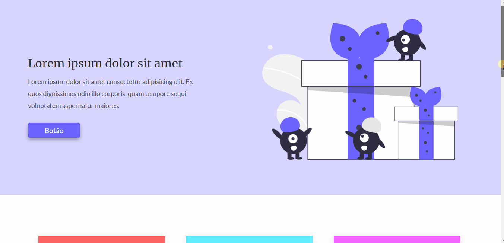

# One Page - Codelândia

<h2>📝 Sobre</h2>

Projeto desenvolvido a partir do desafio 3 proposto pelo Iuri Silva (iuricode) na comunidade Codelândia do Discord.

 
<h2>🎯 Objetivo</h2>

O objetivo era fazer uma one page com cards responsivos e um formulário para contato.

<h2>💻 Tecnologias</h2>
<ul>
    <li>HTML</li>
    <li>CSS</li>
</ul>

<h2>🎬 Gif do site</h2>

<h2>🔗 Link</h2>

<a href="https://naughty-chandrasekhar-5a0f44.netlify.app/" target="_blank">Clique aqui</a>

<h2>📧 Entre em contato:</h2>
  

  

  

